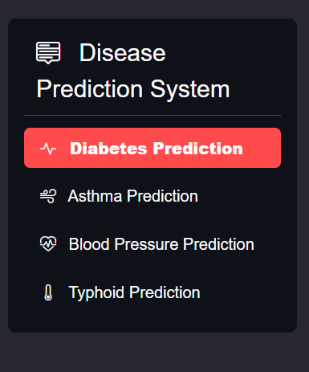
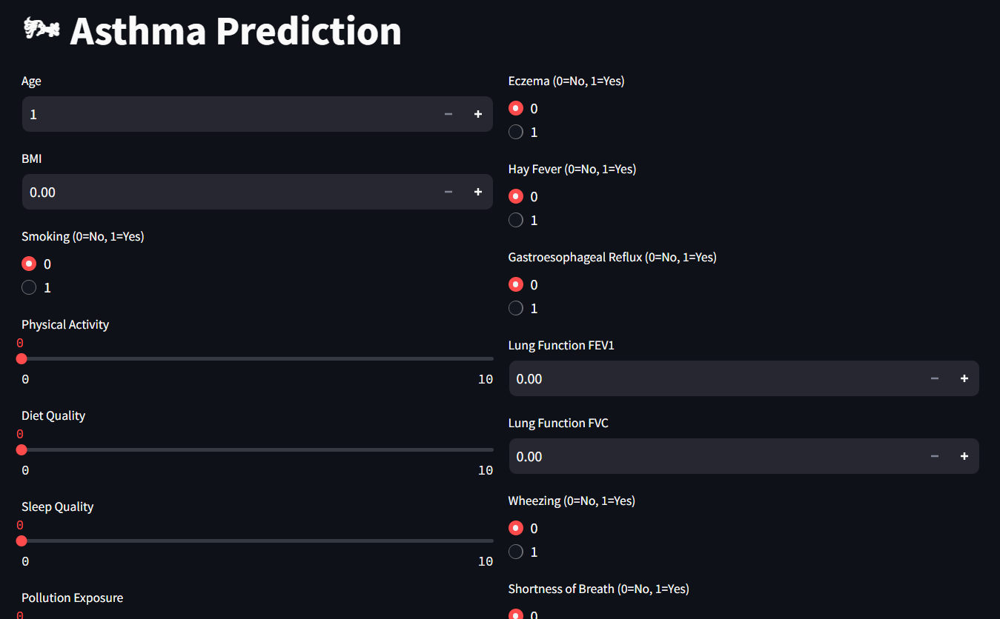
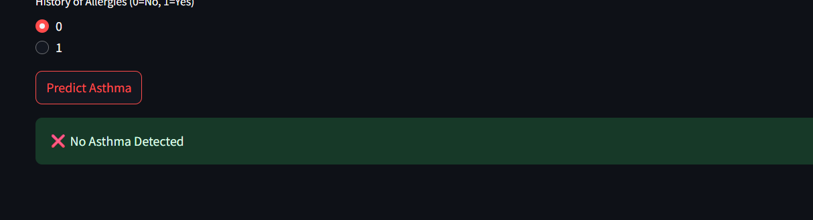
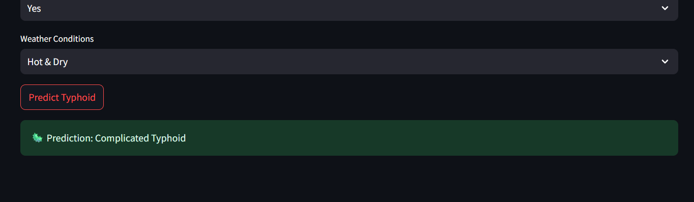

# 🩺 Multi-Disease Classifier

A machine learning-based web app that predicts multiple diseases . Its primary purpose is to allow users to input symptoms and demographic information to predict the likelihood of Diabetes, Asthma, Blood Pressure issues, and Typhoid. Built with Streamlit for easy interaction.

## Features

- Multi-Disease Prediction: Offers prediction capabilities for four distinct diseases.
- User-Friendly Interface: Built with Streamlit, providing an interactive web application.
- Dedicated Input Forms: Each prediction module has a specific form for user input.
- Pre-trained Models: Utilizes pre-trained machine learning models and their corresponding preprocessors for each disease.
- Multiple ML Models : Each disease is predicted using the most suitable algorithm . This modular approach allows for focused development, testing, and potential future expansion to include more disease prediction models.

## 💻 Technology Used
- Python: The primary programming language.
- Streamlit: For building the interactive web application.
- Scikit-learn: For machine learning model training, preprocessing (e.g., StandardScaler, train_test_split, OneHotEncoder), and evaluation metrics (classification report, confusion matrix, accuracy).
- Pandas: For data loading, manipulation, and analysis.
- NumPy: For numerical operations.
- Matplotlib/Seaborn: For data visualization (histograms, boxplots, PCA plots).
- SMOTE (Synthetic Minority Over-sampling Technique): Used to handle class imbalance in datasets.
- XGBoost: Used for Diabetes prediction.
- Random Forest Classifier: Used for Asthma prediction.
- Logistic Regression: Used for Typhoid prediction.
- LightGBM (LGBM): Used for Blood Pressure prediction.
## 📁 Folder Structure

## How to use locally

1. Clone the Repository
 https://github.com/DRITI2906/Multi-Disease-Prediction-Healthcare.git

2. Install Dependencies
 pip install -r requirements.txt

3. Run the Application Locally
 streamlit run app.py

## 🌐 Web App
Explore the deployed version at:

👉 

## Screenshots
**Disease seletion menu**  

**Typhoid prediction Button**  

- 
